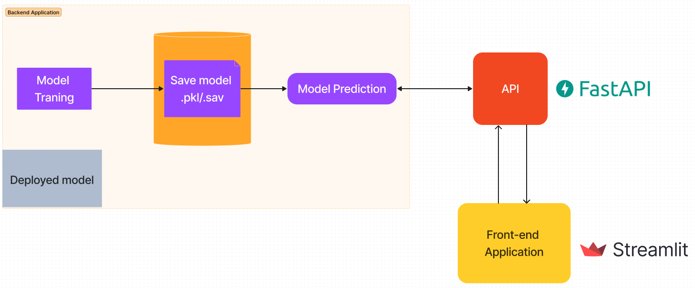

- The project is a demo for a class presentation in which I was asked by my lecturer to do a small demo on how we can you api as a way of deploying our machine learning model into production.
- This demo is simplest one I could create given the limited time I had
- I used FastAPI framework to build the API and link it with the model
- I also used Streamlit as a frontend
- Below is the architure of the application



- To try out the API on local machine you can create a local environment using `Pipenv`.
- You can then install FastAPI and Streamlit using the following commands

  `pipenv install fastapi `
- You will also need an ASGI server, use the following command to install

  ```
  pipenv install "uvicorn[standard]"
  ```
- You can now start the server using the following command:

  ```
  uvicorn lm_api:app
  ```
- You can read more on fastapi [here](https://fastapi.tiangolo.com/#installation)
- To install streamlit using the following command

  ```
  pipenv install streamlit
  ```
- To start streamlit use the command below:

```
streamlit run frontend.py
```

- Make sure you `cd` to src folder for the servers to start running
